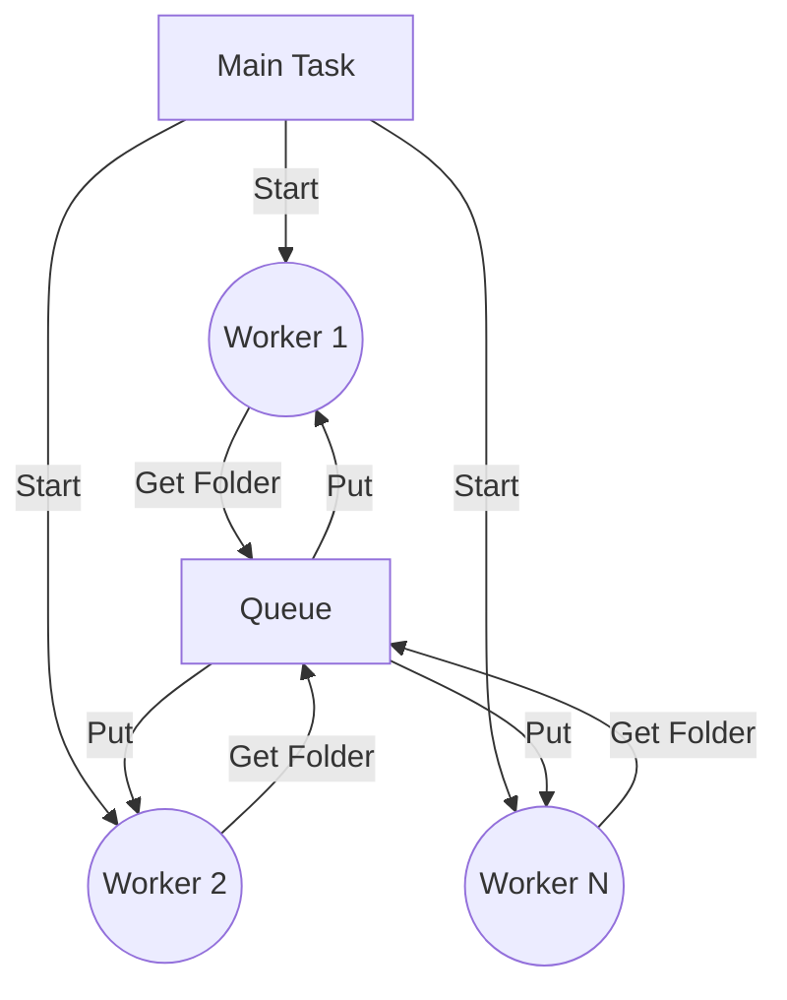

# S3 File Retrieval

This Python script retrieves files from an S3 bucket in parallel using asyncio. 

## Functionality

The script allows retrieving files from an S3 bucket in a parallel, non-blocking way by using asyncio coroutines and queues.

It implements:

- Exponential backoff retry logic using the `backoff` library
- Async IO using `aiobotocore`
- A breadth-first search queue to traverse folders
- Configurable degree of parallelism

The entry point is the `main` async function which calls `retrieve_s3_files`. This sets up the AWS async client, parses the S3 path, and starts the file retrieval process with the configured parallelism degree.

`retrieve_s3_files` coordinates the overall process. It puts the initial prefix into a queue, starts N worker tasks to process the queue, waits for completion, and exits.

Each worker task takes a prefix/folder from the queue, lists files and subfolders under it, puts subfolders back into the queue for further traversal, and retrieves the files themselves.

## Parallel Processing

The parallelism model can be explained as follows:



- The main task starts N worker tasks 
- Each worker task retrieves folders/prefixes from a shared queue 
- Workers put subfolders back into the queue for further traversal
- This allows parallel and recursive traversal of folders

By tuning N, the degree of parallelism can be controlled.

## Key Libraries

The script uses the following key libraries:

- **aiobotocore**: Async IO client for AWS S3
- **backoff**: Provides retry logic with exponential backoff
- **asyncio**: Async IO and queues for parallelism  

## Usage

To use the script:

```
python s3_parallel_retrieval.py
```

Configure:

- s3_path: S3 path to retrieve from
- n: Number of parallel tasks